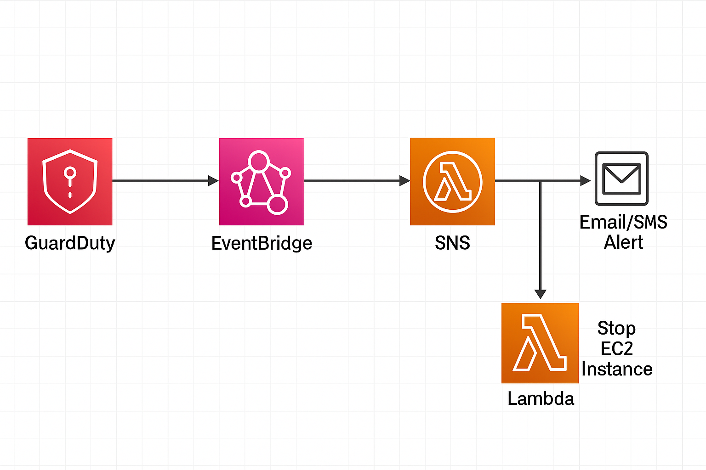

# 🛡️ Auto-Detect & Respond to Cloud Threats Using AWS GuardDuty + SNS Alerts

## 🔍 Overview
This project sets up an automated cloud security response pipeline using:

- **Amazon GuardDuty** to detect threats like port scanning, credential compromise, or unusual activity
- **Amazon SNS** to send real-time alert notifications
- **EventBridge** to route GuardDuty findings
- **(Optional)** AWS Lambda to automatically **quarantine EC2 instances**
- **IAM** to secure access across services

---

## 🧱 Architecture



> Diagram: GuardDuty triggers EventBridge, which notifies SNS. Lambda optionally stops the affected EC2.

---

## 📁 Folder Structure

```plaintext
guardduty-threat-detection/
├── README.md
├── architecture/
│   └── guardduty-sns-architecture.png
├── eventbridge/
│   └── cloudwatch-event-pattern.json
├── sns/
│   └── sns-setup-instructions.md
├── iam/
│   └── guardduty-sns-lambda-policy.json
├── lambda/
│   └── quarantine-instance.py

